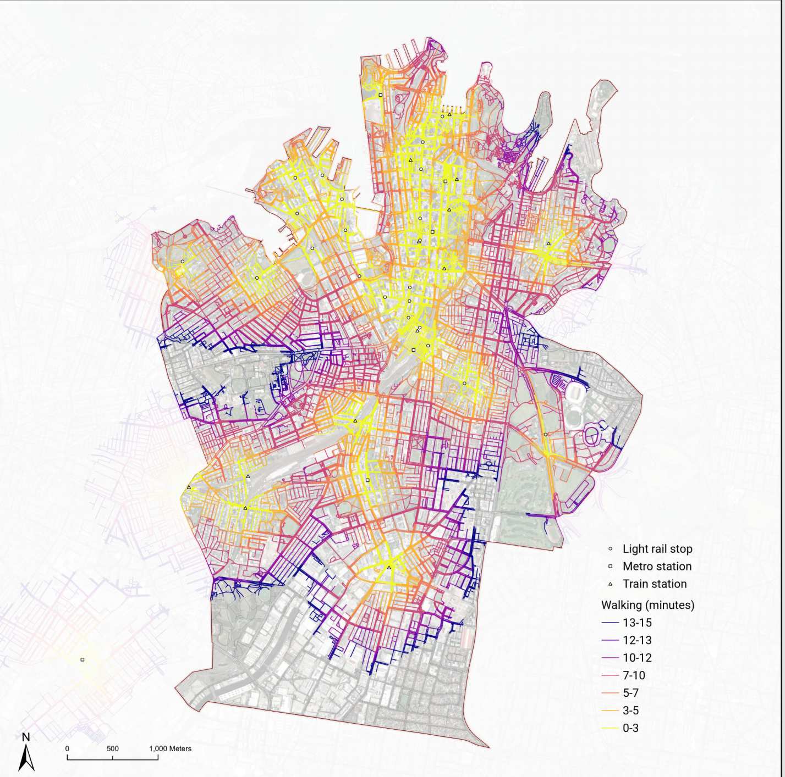
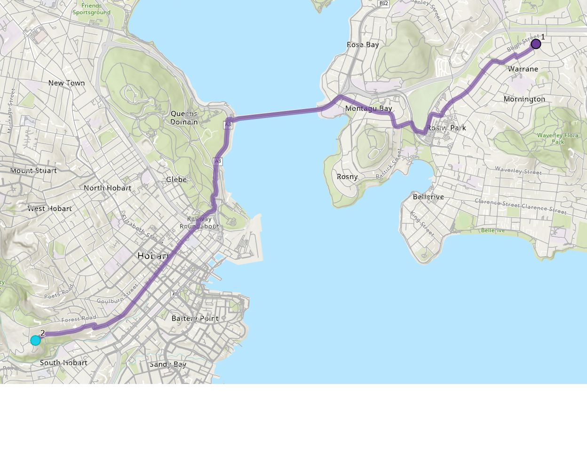

# OSM Walking Network Dataset for ArcGIS Pro

Build a topologically correct pedestrian Network Dataset for any Australian city using free OpenStreetMap data. The output supports pedestrian routing, walk catchment analysis (Service Area), and transit accessibility studies in ArcGIS Pro Network Analyst.

> **Blog post:** *(coming soon)*

---

## Example Output

| Brisbane | Sydney | Hobart |
|---|---|---|
|  |  |  |

*Walk catchment polygons (5, 10, 15 min) generated with ArcGIS Pro Network Analyst Service Area solver.*

---

## What This Produces

- A routable walking Network Dataset inside an ArcGIS File Geodatabase
- **WalkTime** cost in minutes (5 km/h base speed, surface-adjusted on footways and paths)
- **Walking** travel mode configured with correct U-turn and hierarchy settings
- Covers any Australian city — configure with a bounding box and run

---

## Prerequisites

| Requirement | Notes |
|---|---|
| ArcGIS Pro 3.x | With **Network Analyst** extension licensed |
| ArcGIS Pro cloned conda environment | Clone `arcgispro-py3` before installing packages |
| Python packages | `pip install osmnx` (in cloned env) |
| osmconvert | Standalone Windows binary — [download here](https://wiki.openstreetmap.org/wiki/Osmconvert#Windows) |
| Australia PBF | ~900 MB download from Geofabrik — see Step 2 in the notebook |

**Minimum hardware:** 16 GB RAM, ~5 GB free disk space.

---

## Quick Start

1. **Clone this repository**
   ```
   git clone https://github.com/simongis/Create-network-dataset-from-OSM.git
   ```

2. **Download required data files** (not included — too large for GitHub):
   - [Australia PBF](https://download.geofabrik.de/australia-oceania/australia.html) from Geofabrik
   - [osmconvert64.exe](https://wiki.openstreetmap.org/wiki/Osmconvert#Windows)

3. **Open `OSM_Walk_Network_ND.ipynb`** in ArcGIS Pro or Jupyter (using the cloned conda environment)

4. **Edit the CONFIG cell** (first code cell):
   - Set `CITY_NAME` — used in output file names
   - Set `BBOX` — bounding box in WGS84 `(west, south, east, north)`
   - Set `WORK_DIR` — folder where the GDB and intermediate files are created
   - Set paths to `AUSTRALIA_PBF` and `OSMCONVERT_EXE`

5. **Run all cells top to bottom.** The notebook:
   - Clips the Australia PBF to your city bbox (osmconvert)
   - Builds a topologically correct walking graph (osmnx)
   - Filters to walkable highway types, extracts the main connected component
   - Calculates WalkTime with surface-adjusted speeds
   - Exports to a File Geodatabase Feature Dataset
   - Creates and builds the Network Dataset from the included template

### Example bounding boxes

| City | BBOX (west, south, east, north) |
|---|---|
| Hobart | `(147.0, -43.2, 147.6, -42.65)` |
| Sydney CBD | `(150.9, -34.0, 151.4, -33.7)` |
| Melbourne | `(144.7, -38.1, 145.3, -37.6)` |
| Brisbane / SEQ | `(151.73, -28.74, 153.73, -25.74)` |
| Perth | `(115.6, -32.3, 116.1, -31.7)` |

---

## Files in This Repository

| File | Description |
|---|---|
| `OSM_Walk_Network_ND.ipynb` | Main notebook — run this |
| `osm_walk_nd_template.xml` | ArcGIS Network Dataset template (costs + travel mode pre-configured) |

---

## How It Works

### Why osmnx instead of reading OSM directly?

GDAL reads OSM files as raw linestrings with no topology — roads that cross don't share nodes, so pedestrians can't cross between them. osmnx builds a proper NetworkX graph where every intersection becomes a shared node and edges are split correctly. This is what makes the network routable.

### Why a bounding box clip before osmnx?

The Australia PBF is ~900 MB. Loading it directly into osmnx would require 10+ GB RAM and over an hour. osmconvert clips it to your city area in 3–5 minutes first.

### Why no elevation model?

Commercial street datasets use elevation fields to prevent false junctions where a bridge and the road below share the same X,Y coordinate. osmnx already resolves this via OSM node IDs — bridge ways and ground ways have different nodes and share no coordinates. Enabling elevation fields in the Network Dataset would break legitimate bridge connections.

### Projection

The Feature Dataset is created in GDA2020 MGA, automatically selecting the correct zone from your bounding box centre longitude. No manual lookup needed.

---

## Data Sources

| Source | Licence |
|---|---|
| [OpenStreetMap contributors](https://www.openstreetmap.org) | [ODbL](https://opendatacommons.org/licenses/odbl/) |
| [Geofabrik Australia extract](https://download.geofabrik.de/australia-oceania/australia.html) | [ODbL](https://opendatacommons.org/licenses/odbl/) |
| [osmnx](https://osmnx.readthedocs.io) | MIT |
| [osmconvert](https://wiki.openstreetmap.org/wiki/Osmconvert) | GPLv3 |

When publishing analysis based on this network, please acknowledge OpenStreetMap contributors and Geofabrik as data sources.

---

## License

MIT License — see [LICENSE](LICENSE) for details.
